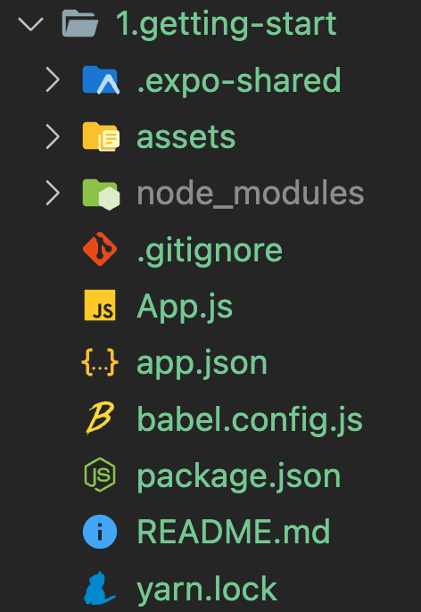
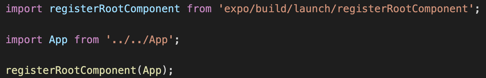

# React-Native-Tutorial

## 1. Stucture of React Native app

- *App.js*: main file, the React Native always point and run this file first. You can change it in `node_modules/expo/AppEntry.js`
- *node_modules/expo/AppEntry.js*: 

## 2. Using the State Hook