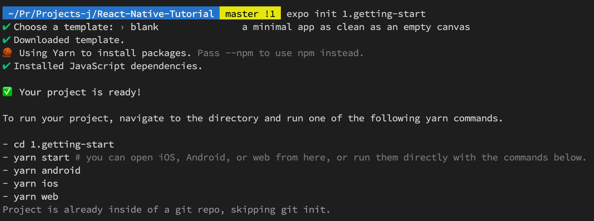

# React-Native-Tutorial
This reposotory for self-learning **[React Native](https://reactnative.dev/)** by using JavaScript. 

If you don't familiar with JavaScript, follow my own [tutorial](https://github.com/DatacollectorVN/JavaScript-Tutorial).

My own document of React-Native, click [here](https://playful-sting-171.notion.site/fc9ff96f52854b90a78c3f4631e40693?v=13c9219aa53d45c0b78aca90acc8783f) 
## Setup requirements
### 1. Install [Nodejs](https://reactnative.dev)
After installing, verify:

`node -v`

*Expected output:* v16.14.2 (depend on your version).

`npm -v`

*Expected output:* 8.5.0 (depend on your version).

### 2. Install Expo-CLI and Yarn
[Expo-CLI]("https://docs.expo.dev/workflow/expo-cli/") is a command line app that is the main interface between a developer and Expo tools for developing and publising app.

[Yarn]("https://yarnpkg.com") is a package manager that doubles down as project manager.

`npm install -g expo-cli yarn`

After installing, verify:

`yarn -v`

*Expected output:* 1.22.18 (depend on your version).

`react-native -v`

*Expeted output:* react-native-cli: 2.0.1 react-native: 0.67.4 (depend on your version).

`expo --version`
*Expected output:* 5.3.0 (depend on your version).

#### Note: 
If you get error like `expo: command not found` or `react-native comand not found`, please following my resolve:

If you got full error like `-bash: expo: command not found` to resolve this:
+ Check PATH: `echo $PATH`, the output you will not see *.npm-global*.
+ Add PATH and activate bash_profile: `export PATH=$PATH:~/.npm-global/bin` and `source ~/.bash_profile`.
+ Check PATH again: `echo $PATH`, you will see *.npm-global*.

If you get error like `zsh: command not found` to resolve this:
+ Open *.zshrc*: `open ~/.zshrc`.
+ Add in *.zshrc:* `export PATH=$PATH:~/.npm-global/bin`, save it and exit.
+ Check PATH: `echo $PATH`, you will see *.npm-global*.

## Getting Start

Generate new app. (`Note: choose blank template`)
```bash
expo init 1.getting-start
```
*Expected output:*



Start run app.
```bash
cd 1.getting-start
yarn start
```

## 4. node_modules
*node_modules* contains all packes dependency of your app project. You can create this again by `yarn install`.

If you want to add some new in react-native like [React Navigation](https://reactnavigation.org/docs/getting-started/) you can add this into *node_modules*.

`yarn add @react-navigation/native`

After adding, you can see *native* folder in *node_modules/@react-navigation/native*.

